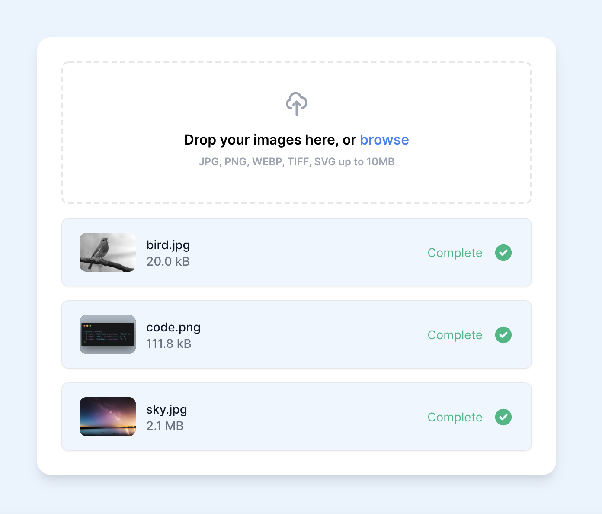

# Cloud Capture Components

A set of react components to easily manage images with the cloud capture API. Check out some [live examples here](https://www.cloudcapture.io/docs/components)



## Installation

Install with npm or yarn

NPM

```
npm i cloud-capture-components
```

Yarn

```
yarn add cloud-capture-components
```

## Setup

Add the provider to the root of your application

```jsx
import { Provider, UploadForm } from 'cloud-capture-components';

const App = () => (
  <Provider>
    <UploadForm {...props} />
  </Provider>
);
```

## Upload Form

Use the upload form to easily upload one or many images to your configured source.

### Component

```jsx
<UploadForm
  onRequestUpload={() => {
    // Within your own server call https://api.cloudcapture.io/{source_name}/upload/sign?apiKey={api_key}
    return fetch('http://localhost:3000/get-signed-payload')
      .then(res => res.json())
      .then(res => res);
  }}
/>
```

### Props

| Prop               | Type                         | Description                  |
| ------------------ | ---------------------------- | ---------------------------- |
| dropText           | string                       | Text to display in dropzone  |
| onRequestUpload \* | () => Promise<UploadPayload> | Request for a signed payload |
| onUploadStart      | () => void                   | Called when upload begins    |
| onUploadEnd        | () => Entries                | Called when upload ends      |

## Signing uploads

Uploads are made directly from the browser to your configured source. To obtain an uploadToken you need to call the cloud capture api `https://api.cloudcapture.io/{source_name}/upload/sign?apiKey={api_key}` securely from your own server.

```
POST https://api.cloudcapture.io/{source_name}/upload/sign?apiKey={api_key}
```

Your api_key can be found at the cloud capture dashboard.
